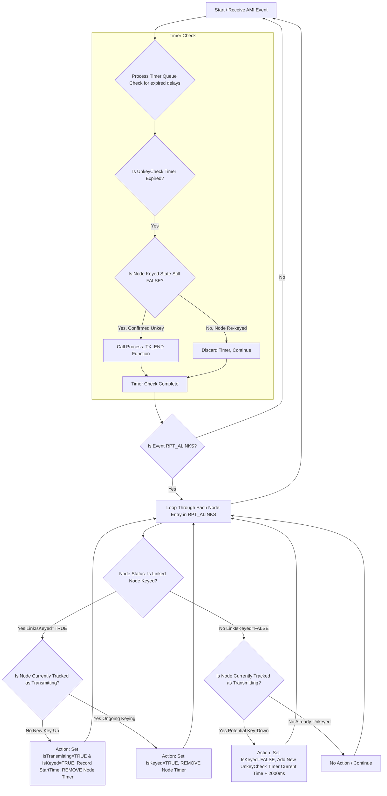

# AMI Keying Tracker with Jitter Compensation

This document describes the implementation of the jitter-compensated keying tracker for AllstarLink AMI events.

## Overview

The keying tracker monitors AllstarLink node activity using AMI events to differentiate local node keying from linked node activity. It uses a **2-second delay timer** to compensate for network jitter before confirming key-down events.

## Key AMI Variables

### Local Transmit Status

| Variable | Format | Purpose |
|----------|--------|---------|
| `RPT_TXKEYED` | Integer (0 or 1) | Reports the direct status of the local node's main radio transmitter. A value of 1 means the node's transmitter is ON, sending audio (sourced locally or from a link). A value of 0 means the transmitter is OFF. |

### Link Counts and Scope

| Variable | Format | Purpose | Scope |
|----------|--------|---------|-------|
| `RPT_NUMALINKS` | Integer | Counts only the nodes directly connected (adjacent) to your local node. | Adjacent Links Only |
| `RPT_NUMLINKS` | Integer | Counts the total number of nodes in the current net, including all nodes directly and indirectly (multi-hop) linked to your system. | All Links (Global) |

### Link Data Strings

| Variable | Format | Purpose | Keying Status Included? |
|----------|--------|---------|------------------------|
| `RPT_ALINKS` | `<Count>,<NodeID><Mode><Keyed>[,...]` | Lists all adjacent links along with their operating mode and, most critically, their real-time keying status. This is the primary data source for identifying the source node. | ✅ Yes (K=Keyed, U=Unkeyed) |
| `RPT_LINKS` | `<Count>,<NodeID><Mode>[,...]` | Lists all links (adjacent and non-adjacent). It provides a complete map of the linked network topology. | ❌ No |

## Architecture

### State Machine Flow

The keying tracker implements a state machine with a timer queue to handle jitter compensation:



### Core Data Structures

#### KeyingTracker

```go
type KeyingTracker struct {
    localNodeID    int                          // The local source node ID
    adjacentNodes  map[int]*AdjacentNodeStatus  // Map of adjacent node ID -> status
    timerQueue     []UnkeyCheckTimer            // Queue of pending unkey confirmations
    delayMS        int                          // Delay in milliseconds (default 2000)
}
```

#### AdjacentNodeStatus

```go
type AdjacentNodeStatus struct {
    NodeID          int
    IsKeyed         bool
    KeyedStartTime  *time.Time
    IsTransmitting  bool
    TotalTxSeconds  int

    // Node information for display
    Callsign        string
    Description     string

    // Link information
    Mode            string
    Direction       string
    IP              string
    ConnectedSince  time.Time
}
```

## Implementation Logic

### 1. TX START Detection

When a linked node is keyed (`LinkIsKeyed=TRUE`) and not currently transmitting:

1. Set `IsKeyed = TRUE`
2. Set `IsTransmitting = TRUE`
3. Record `KeyedStartTime = CurrentTimestamp`
4. Clear any pending `UnkeyCheck` timers for this node
5. Emit `TX_START` callback

### 2. Potential TX STOP (Delay Timer)

When a linked node unkeys (`LinkIsKeyed=FALSE`) while currently transmitting:

1. Set `IsKeyed = FALSE` (temporarily)
2. Schedule an `UnkeyCheck` timer for `CurrentTime + 2000ms`
3. Wait for timer expiration or re-keying

### 3. Ongoing Keying (Jitter Cancellation)

When a linked node is still keyed (`LinkIsKeyed=TRUE`) while transmitting:

1. Set `IsKeyed = TRUE` (ensure state is correct)
2. Clear any pending `UnkeyCheck` timers (was just jitter)
3. Continue tracking transmission

### 4. Confirmed TX STOP

When the 2-second delay timer expires and the node is still unkeyed:

1. Calculate duration: `EndTime - KeyedStartTime`
2. Update `TotalTxSeconds += duration`
3. Reset `IsTransmitting = FALSE`
4. Clear `KeyedStartTime`
5. Emit `TX_END` callback with duration

## WebSocket Events

### SOURCE_NODE_KEYING

Emitted when a source node's keying state changes:

```json
{
  "messageType": "SOURCE_NODE_KEYING",
  "data": {
    "source_node_id": 594950,
    "adjacent_nodes": {
      "634021": {
        "NodeID": 634021,
        "IsKeyed": true,
        "IsTransmitting": true,
        "KeyedStartTime": "2025-10-08T23:45:12Z",
        "TotalTxSeconds": 145,
        "Callsign": "W1ABC",
        "Description": "Boston Repeater",
        "Mode": "T",
        "Direction": "IN",
        "ConnectedSince": "2025-10-08T20:15:30Z"
      }
    },
    "tx_keyed": true,
    "rx_keyed": false,
    "timestamp": "2025-10-08T23:45:12Z"
  },
  "timestamp": 1696807512000
}
```

## Frontend Display

The frontend displays each source node in a separate card with:

1. **Source Node Header**
   - Node ID
   - TX/RX status indicators

2. **Adjacent Links Table**
   - Node ID (with link to stats.allstarlink.org)
   - Callsign (with link to QRZ.com)
   - Keying status (Keyed/Idle)
   - Connected time
   - TX state (with pulsing indicator when transmitting)
   - Duration (live timer during TX, total time after)

3. **Link Count Indicators**
   - Global Links (`RPT_NUMLINKS`) - total network size
   - Adjacent Links (`RPT_NUMALINKS`) - direct connections

## Configuration

Source nodes are configured in `config.yaml`:

```yaml
# Multiple source nodes
nodes: [594950, 595123]

# Or with names
nodes:
  - node_id: 594950
    name: "Main Repeater"
  - node_id: 595123
    name: "Remote Base"
```

The keying tracker is automatically initialized for each configured source node with a 2-second jitter delay.

## Benefits

1. **Accurate Keying Detection** - Differentiates between local and remote node activity
2. **Jitter Compensation** - 2-second delay prevents false unkey events from network glitches
3. **Per-Node Tracking** - Separate trackers for each source node in multi-node setups
4. **Real-time Updates** - WebSocket events provide instant updates to connected clients
5. **Duration Tracking** - Accurate TX duration calculation with sub-second precision
6. **Persistent Stats** - Total TX seconds survive server restarts
